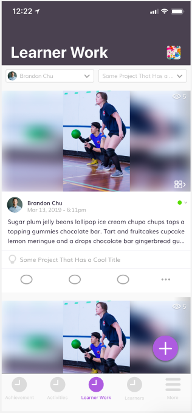
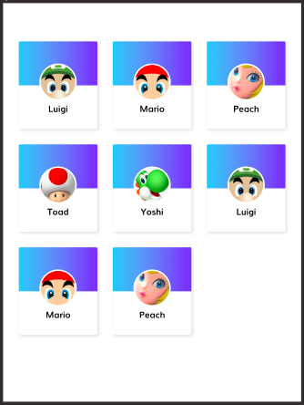

# Swift Coding Challenge

This challenge is designed to demonstrate your knowledge of Xcode & Swift.

<h1> Getting Started </h1>

<h3> Instructions </h3>
<ol> 
  <li> Create a new Xcode project and push it to a public repo. </li>
  <li> Complete the challenge and commit changes to your new repo. <strong> Create a new commit for each challenge, with a meaningful title & message.</strong></li>
  <li> Once complete, share a link to your public repo with the Wabisabi team.</li>
</ol>

<h4> Prerequisites </h4>
<ul>
  <li> Xcode 11+ </li>
  <li> Swift 4+ </li>
  <li> iOS Deployment Target 13+ </li>
</ul>

<h1> Challenge </h1>
<strong> 
  <ul>
    <li> Use autolayout and varying constraints for size classes to create a dynamic layout for iphone & ipad. </li>
    <li> Use a collectionView to lay out the elements - the User cards. </li>
    <li> Create a User struct that has the following properties: 
          <ul>
            <li> avatar </li> 
            <li> name </li>
          </ul>
    <li> Load cells programmatically from an array of values parsed from this JSON response:   
         [   
         &nbsp;&nbsp;&nbsp;&nbsp;{   
         &nbsp;&nbsp;&nbsp;&nbsp;&nbsp;&nbsp;&nbsp;&nbsp;"avatar": https://vignette.wikia.nocookie.net/characterprofile/images/7/75/Mario.png,   
         &nbsp;&nbsp;&nbsp;&nbsp;&nbsp;&nbsp;&nbsp;&nbsp;"name": OG Mario   
          &nbsp;&nbsp;&nbsp;&nbsp;},   
          &nbsp;&nbsp;&nbsp;&nbsp;{   
         &nbsp;&nbsp;&nbsp;&nbsp;&nbsp;&nbsp;&nbsp;&nbsp;"avatar": https://vignette.wikia.nocookie.net/characterprofile/images/c/c4/Fire_mario.png,   
         &nbsp;&nbsp;&nbsp;&nbsp;&nbsp;&nbsp;&nbsp;&nbsp;"name": Fire Mario   
          &nbsp;&nbsp;&nbsp;&nbsp;},   
          &nbsp;&nbsp;&nbsp;&nbsp;{   
         &nbsp;&nbsp;&nbsp;&nbsp;&nbsp;&nbsp;&nbsp;&nbsp;"avatar": https://vignette.wikia.nocookie.net/characterprofile/images/9/9a/Tanooki_mario.png,   
         &nbsp;&nbsp;&nbsp;&nbsp;&nbsp;&nbsp;&nbsp;&nbsp;"name": Raccoon Mario   
          &nbsp;&nbsp;&nbsp;&nbsp;}   },   
          &nbsp;&nbsp;&nbsp;&nbsp;{   
         &nbsp;&nbsp;&nbsp;&nbsp;&nbsp;&nbsp;&nbsp;&nbsp;"avatar": https://vignette.wikia.nocookie.net/characterprofile/images/d/d1/Invincible_Mario.png,   
         &nbsp;&nbsp;&nbsp;&nbsp;&nbsp;&nbsp;&nbsp;&nbsp;"name": Rainbow Mario   
          &nbsp;&nbsp;&nbsp;&nbsp;}   },   
          &nbsp;&nbsp;&nbsp;&nbsp;{   
         &nbsp;&nbsp;&nbsp;&nbsp;&nbsp;&nbsp;&nbsp;&nbsp;"avatar": https://vignette.wikia.nocookie.net/characterprofile/images/8/83/1452500936178.png,   
         &nbsp;&nbsp;&nbsp;&nbsp;&nbsp;&nbsp;&nbsp;&nbsp;"name": Cloud Mario   
          &nbsp;&nbsp;&nbsp;&nbsp;}   },   
          &nbsp;&nbsp;&nbsp;&nbsp;{   
         &nbsp;&nbsp;&nbsp;&nbsp;&nbsp;&nbsp;&nbsp;&nbsp;"avatar": https://vignette.wikia.nocookie.net/characterprofile/images/8/87/SML2RabbitMario.png,   
         &nbsp;&nbsp;&nbsp;&nbsp;&nbsp;&nbsp;&nbsp;&nbsp;"name": Rabbit Mario   
         &nbsp;&nbsp;&nbsp;&nbsp;}   },   
         &nbsp;&nbsp;&nbsp;&nbsp;{   
         &nbsp;&nbsp;&nbsp;&nbsp;&nbsp;&nbsp;&nbsp;&nbsp;"avatar": https://vignette.wikia.nocookie.net/characterprofile/images/2/27/250px-Dr_Mario_-_Dr_Mario_Miracle_Cure.png,   
         &nbsp;&nbsp;&nbsp;&nbsp;&nbsp;&nbsp;&nbsp;&nbsp;"name": Doctor Mario   
         &nbsp;&nbsp;&nbsp;&nbsp;}   },   
         &nbsp;&nbsp;&nbsp;&nbsp;{   
         &nbsp;&nbsp;&nbsp;&nbsp;&nbsp;&nbsp;&nbsp;&nbsp;"avatar": https://vignette.wikia.nocookie.net/characterprofile/images/5/50/1452500917700.png,   
         &nbsp;&nbsp;&nbsp;&nbsp;&nbsp;&nbsp;&nbsp;&nbsp;"name": Bee Mario   
         &nbsp;&nbsp;&nbsp;&nbsp;}   },   
         &nbsp;&nbsp;&nbsp;&nbsp;{   
         &nbsp;&nbsp;&nbsp;&nbsp;&nbsp;&nbsp;&nbsp;&nbsp;"avatar": https://vignette.wikia.nocookie.net/characterprofile/images/b/b4/Penguin_Mario.png,   
         &nbsp;&nbsp;&nbsp;&nbsp;&nbsp;&nbsp;&nbsp;&nbsp;"name": Penguin Mario   
         &nbsp;&nbsp;&nbsp;&nbsp;}   },   
         &nbsp;&nbsp;&nbsp;&nbsp;{   
         &nbsp;&nbsp;&nbsp;&nbsp;&nbsp;&nbsp;&nbsp;&nbsp;"avatar": https://vignette.wikia.nocookie.net/characterprofile/images/5/55/Frog_mario.png,   
         &nbsp;&nbsp;&nbsp;&nbsp;&nbsp;&nbsp;&nbsp;&nbsp;"name": Frog Mario   
         &nbsp;&nbsp;&nbsp;&nbsp;}   },   
         &nbsp;&nbsp;&nbsp;&nbsp;{   
         &nbsp;&nbsp;&nbsp;&nbsp;&nbsp;&nbsp;&nbsp;&nbsp;"avatar": https://vignette.wikia.nocookie.net/characterprofile/images/9/9d/860px-Squirrel_Mario_NSMBU.png,   
         &nbsp;&nbsp;&nbsp;&nbsp;&nbsp;&nbsp;&nbsp;&nbsp;"name": Squirrel Mario   
         &nbsp;&nbsp;&nbsp;&nbsp;}   },   
         &nbsp;&nbsp;&nbsp;&nbsp;{   
         &nbsp;&nbsp;&nbsp;&nbsp;&nbsp;&nbsp;&nbsp;&nbsp;"avatar": https://vignette.wikia.nocookie.net/characterprofile/images/4/47/ShellMario.png,   
         &nbsp;&nbsp;&nbsp;&nbsp;&nbsp;&nbsp;&nbsp;&nbsp;"name": Turtle Mario   
         &nbsp;&nbsp;&nbsp;&nbsp;}   },   
         &nbsp;&nbsp;&nbsp;&nbsp;{   
         &nbsp;&nbsp;&nbsp;&nbsp;&nbsp;&nbsp;&nbsp;&nbsp;"avatar": https://vignette.wikia.nocookie.net/characterprofile/images/3/32/684px-WingMarioSM64DS.png,   
         &nbsp;&nbsp;&nbsp;&nbsp;&nbsp;&nbsp;&nbsp;&nbsp;"name": Flying Mario   
         &nbsp;&nbsp;&nbsp;&nbsp;}   },   
         &nbsp;&nbsp;&nbsp;&nbsp;{   
         &nbsp;&nbsp;&nbsp;&nbsp;&nbsp;&nbsp;&nbsp;&nbsp;"avatar": https://vignette.wikia.nocookie.net/characterprofile/images/2/23/Metal_Mario.png,   
         &nbsp;&nbsp;&nbsp;&nbsp;&nbsp;&nbsp;&nbsp;&nbsp;"name": Metal Mario   
         &nbsp;&nbsp;&nbsp;&nbsp;}   },   
         &nbsp;&nbsp;&nbsp;&nbsp;{   
         &nbsp;&nbsp;&nbsp;&nbsp;&nbsp;&nbsp;&nbsp;&nbsp;"avatar": https://vignette.wikia.nocookie.net/characterprofile/images/6/63/Ice_Mario_2.png,   
         &nbsp;&nbsp;&nbsp;&nbsp;&nbsp;&nbsp;&nbsp;&nbsp;"name": Ice Mario   
         &nbsp;&nbsp;&nbsp;&nbsp;}   
          ]  
      </li>
    <li> Add any files or comments you need to complete the challenge. We are especially interested in clean code and MVVM architectures. </li>
  </ul> 
</strong>

 
<strong> iPhone </strong>
<ul>
    <li> Cell takes up full width of the screen. Vertical scroll. </li>
    <li> Left-align avatar. </li>
    <li> Name inline with image. </li>
</ul> 

 
<strong> iPad </strong>
<ul>
  <li> Three cells per row, evenly spaced. Vertical scroll. </li>
  <li> Center-align avatar. </li>
  <li> Name is below the image. </li>
</ul> 

 
Dimensions of the ui elements do not have to exactly match with the reference images provided; cells do not need to have gradients and shadows.
