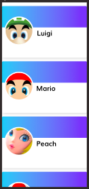

# Swift Coding Challenge

This challenge is designed to demonstrate your knowledge of Xcode & Swift.

<h1> Getting Started </h1>

<h3> Instructions </h3>
<ol> 
  <li> Create a new Xcode project and push it to a public repo. </li>
  <li> Complete the challenge and commit changes to your new repo. <strong> Create a new commit for each challenge, with a meaningful title & message.</strong></li>
  <li> Once complete, share a link to your public repo with the Wabisabi team.</li>
</ol>

<h4> Prerequisites </h4>
<ul>
  <li> Xcode 11+ </li>
  <li> Swift 4+ </li>
  <li> iOS Deployment Target 13+ </li>
</ul>

<h1> Challenge </h1>
<strong> 
  <ul>
    <li> Use autolayout and varying constraints for size classes to create a dynamic layout for iphone & ipad. </li>
    <li> Use a collectionView to lay out the elements - the cards, each composed of an image and text. </li>
    <li> You can use any image and text you'd like. </li>
    <li> Add any files or comments you need to complete each challenge. We are especially interested in clean code and MVVM architectures. </li>
  </ul> 
</strong>

  
<strong> iPhone </strong>
<ul>
    <li> Cell takes up full width of the screen. Vertical scroll. </li>
    <li> Left-align image. </li>
    <li> Text inline with image. </li>
</ul> 

  
<strong> iPad </strong>
<ul>
  <li> Three cells per row. Vertical scroll. </li>
  <li> Center-align image. </li>
  <li> Text is below the image. </li>
</ul> 

